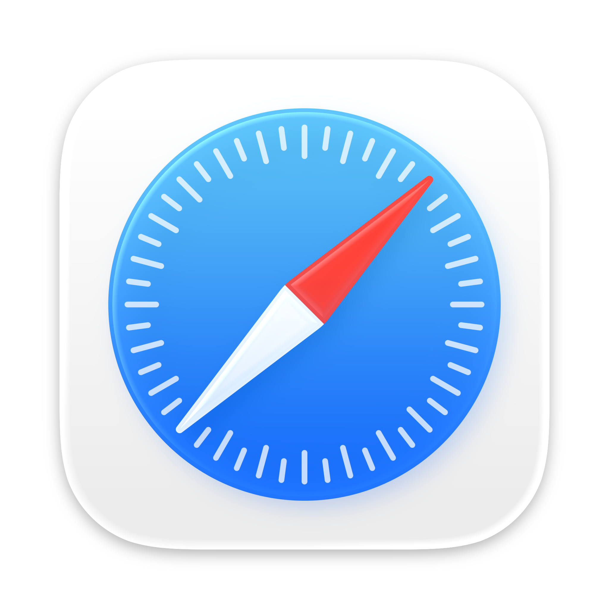

# **BOFA**
**B**rowser **O**verview **F**eed for **A**pple

Welcome to the **BOFA** repository! This resource tracks the latest versions of major web browsers for macOS. Feeds are automatically updated every hour from XML and JSON links directly from vendors.

We welcome community contributions—fork the repository, ask questions, or share insights to help keep this resource accurate and useful for everyone. Check out the user-friendly website version below for an easier browsing experience!

### [bofa.cocolabs.dev](https://bofa.cocolabs.dev)

## Latest Stable Browser Versions

<table>
  <tr>
    <td align="center"> <b>Chrome</b> 133.0.6943.127 <a href="https://chromereleases.googleblog.com/" style="text-decoration: none;"><small>Release Notes</small></a></td>
    <td align="center"> <b>Firefox</b> 135.0.1 <a href="https://www.mozilla.org/en-US/firefox/notes/" style="text-decoration: none;"><small>Release Notes</small></a></td>
    <td align="center"> <b>Edge</b> 133.0.3065.82 <a href="https://learn.microsoft.com/en-us/deployedge/microsoft-edge-relnote-stable-channel" style="text-decoration: none;"><small>Release Notes</small></a></td>
    <td align="center"> <b>Safari</b> 18.3 <a href="https://developer.apple.com/documentation/safari-release-notes" style="text-decoration: none;"><small>Release Notes</small></a></td>
  </tr>
</table>

## Browser Packages

All links below direct to the official browser vendor. The links provided will always download the latest available version as of the last scan update.  

**Chrome**: [**_Raw XML_**](latest_chrome_files/chrome_latest_versions.xml) [**_Raw YAML_**](latest_chrome_files/chrome_latest_versions.yaml) [**_Raw JSON_**](latest_chrome_files/chrome_latest_versions.json) | **Firefox**: [**_Raw XML_**](latest_firefox_files/firefox_latest_versions.xml) [**_Raw YAML_**](latest_firefox_files/firefox_latest_versions.yaml) [**_Raw JSON_**](latest_firefox_files/firefox_latest_versions.json)

**Edge**: [**_Raw XML_**](latest_edge_files/edge_latest_versions.xml) [**_Raw YAML_**](latest_edge_files/edge_latest_versions.yaml) [**_Raw JSON_**](latest_edge_files/edge_latest_versions.json) | **Safari**: [**_Raw XML_**](latest_safari_files/safari_latest_versions.xml) [**_Raw YAML_**](latest_safari_files/safari_latest_versions.yaml) [**_Raw JSON_**](latest_safari_files/safari_latest_versions.json)

_Last Updated: <code style="color : mediumseagreen">February 23, 2025 05:11 PM EST</code> (Automatically Updated every hour)_

| **Browser** | **CFBundle Version** | **CFBundle Identifier** | **Download** |
|------------|-------------------|---------------------|------------|
| **Chrome**   <a href="https://chromereleases.googleblog.com/" style="text-decoration: none;"><small>_Release Notes_</small></a> | `133.0.6943.127` | `com.google.Chrome` |  |
| **Chrome** Beta  <a href="https://chromereleases.googleblog.com/search/label/Beta%20updates" style="text-decoration: none;"><small>_Release Notes_</small></a> | `134.0.6998.23` | `com.google.Chrome.beta` |  |
| **Chrome** Dev  <a href="https://chromereleases.googleblog.com/search/label/Dev%20updates" style="text-decoration: none;"><small>_Release Notes_</small></a> | `135.0.7023.0` | `com.google.Chrome.dev` |  |
| **Chrome** Canary  | `135.0.7032.0` | `com.google.Chrome.canary` |  |
| **Firefox**   <a href="https://www.mozilla.org/en-US/firefox/notes/" style="text-decoration: none;"><small>_Release Notes_</small></a> | `135.0.1` | `org.mozilla.firefox` |  |
| **Firefox** Beta  <a href="https://www.mozilla.org/en-US/firefox/beta/notes/" style="text-decoration: none;"><small>_Release Notes_</small></a> | `136.0b9` | `org.mozilla.firefoxbeta` |  |
| **Firefox** Developer  <a href="https://www.mozilla.org/en-US/firefox/developer/notes/" style="text-decoration: none;"><small>_Release Notes_</small></a> | `136.0b9` | `org.mozilla.firefoxdev` |  |
| **Firefox** ESR  <a href="https://www.mozilla.org/en-US/firefox/organizations/notes/" style="text-decoration: none;"><small>_Release Notes_</small></a> | `128.7.0esr` | `org.mozilla.firefoxesr` |  |
| **Firefox** ESR 115  | `115.20.0esr` | `org.mozilla.firefoxesr` |  |
| **Firefox** Nightly  <a href="https://www.mozilla.org/en-US/firefox/nightly/notes/" style="text-decoration: none;"><small>_Release Notes_</small></a> | `137.0a1` | `org.mozilla.nightly` |  |
| **Edge**   <a href="https://learn.microsoft.com/en-us/deployedge/microsoft-edge-relnote-stable-channel" style="text-decoration: none;"><small>_Release Notes_</small></a> | `133.0.3065.82` | `com.microsoft.edgemac` |  |
| **Edge** Preview  | `133.0.3065.82` | `com.microsoft.edgemac.dev` |  |
| **Edge** Beta  <a href="https://learn.microsoft.com/en-us/deployedge/microsoft-edge-relnote-beta-channel" style="text-decoration: none;"><small>_Release Notes_</small></a> | `133.0.3065.82` | `com.microsoft.edgemac.beta` |  |
| **Edge Insider** Beta  | `134.0.3124.19` | `com.microsoft.edgemac.insider.beta` |  |
| **Edge Insider** Developer  | `135.0.3140.0` | `com.microsoft.edgemac.insider.dev` |  |
| **Edge Insider** Canary  | `135.0.3154.0` | `com.microsoft.edgemac.insider.canary` |  |
| **Safari** Sequoia/Sonoma  <a href="https://developer.apple.com/documentation/safari-release-notes" style="text-decoration: none;"><small>_Release Notes_</small></a> | `18.3` | `com.apple.Safari` |  |
| **Safari** Ventura  | `18.3` | `com.apple.Safari` |  |
| **Safari** Monterey  | `17.6` | `com.apple.Safari` |  |
| **Safari** BigSur  | `16.6.1` | `com.apple.Safari` |  |

## Browser Settings Management

View your current browser policies and explore available policy options:

###  Chrome
1. **View Current Policies**: Enter `chrome://policy` in your address bar to see active policies
2. **Available Options**: [Chrome Enterprise Policy Documentation](https://chromeenterprise.google/policies/)

###  Firefox
1. **View Current Policies**: Enter `about:policies` in your address bar to see active policies
2. **Available Options**: [Firefox Policy Documentation](https://mozilla.github.io/policy-templates/)

###  Edge
1. **View Current Policies**: Enter `edge://policy` in your address bar to see active policies
2. **Available Options**: [Edge Policy Documentation](https://learn.microsoft.com/en-us/deployedge/microsoft-edge-policies)

###  Safari
1. **View Current Policies**: Open System Settings > Profiles & Device Management
2. **Available Options**: [Safari Configuration Profile Reference](https://support.apple.com/guide/deployment/welcome/web)

